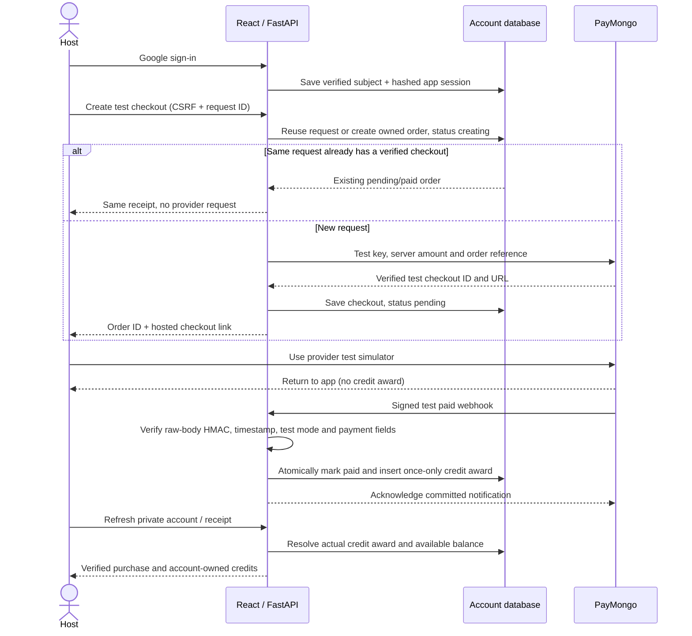
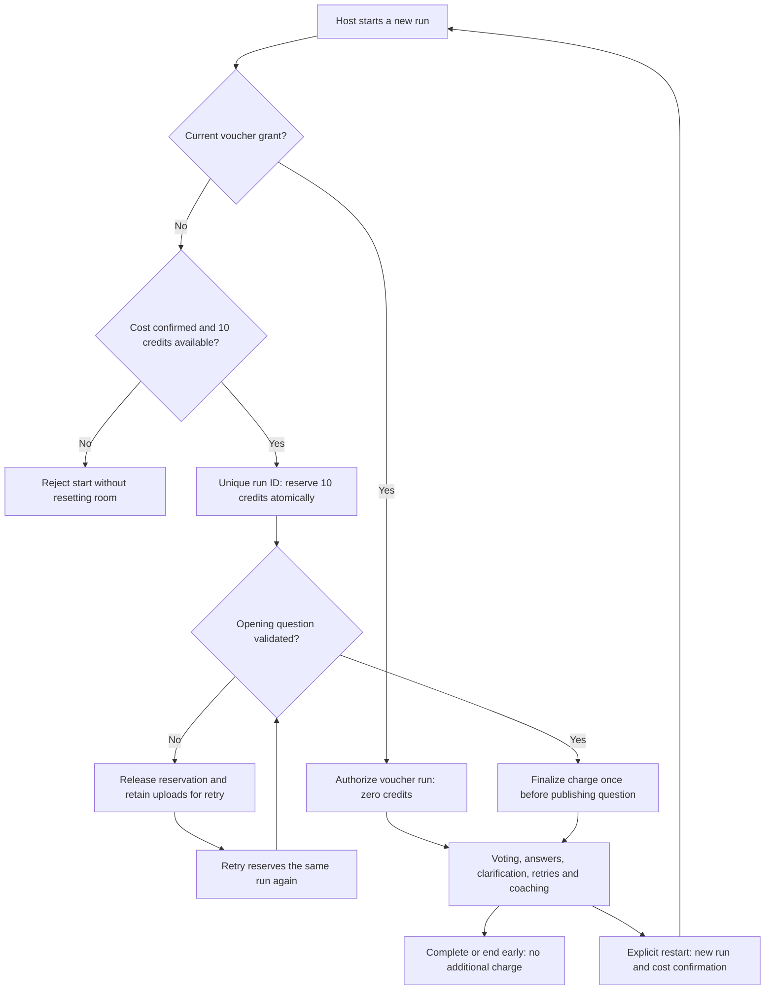

# Account and sandbox-payment flow

This maps the implemented feature-branch flow, not a certification or a
real-money launch. PHP 100 → 100 test credits and 10 credits per run are sandbox
fixtures. No live PayMongo key is accepted. The payment-cleanup changes must be
deployed before their new tracking and checkout protections appear online.

## Purchase and credit award



`POST /api/payments/test/checkout` requires a valid account, exact configured
origin and session CSRF token. The body cannot choose amount, currency, credit
quantity or account. The app supplies an `Idempotency-Key` saved before sending:
retries reuse that key after a lost response. The server stores an account-bound
fingerprint, never the submitted key itself, and serializes lookup/insertion.
Already pending/paid requests return the existing order. In-flight or unverified
creation returns a safe 409 and does not issue another provider request.

Older clients without a key still work, but do not get request reuse. All clients
are limited to five new checkout attempts per account in ten minutes; duplicate
request lookups do not consume another attempt. Switching browser sessions does
not reset this database-backed limit. This is scoped checkout throttling, not
site-wide abuse protection.

Only a valid signed notification awards credits. Validation binds the stored
reference, checkout ID, amount, currency and paid payment ID. An already paid
receipt rejects a different payment ID. One unique payment cannot pay a second
order and one order cannot receive a second credit award. Receipt and award
commit together, including on PostgreSQL; a failure rolls both back. An early
notification while registration is creating gets 503 so the provider can retry.
Unknown orders and irrelevant authenticated events are acknowledged without
awarding anything. Rejected requests never repair or fabricate payment records.

Test signatures use `te`, SHA-256 HMAC of timestamp + period + exact raw body,
constant-time comparison, and a five-minute timestamp window. Bodies above 1 MB
are rejected. These follow the provider's [webhook verification guidance](https://docs.paymongo.com/docs/developer-tools-webhook-setup-management).

New receipts are retrieved through the purchasing account's HttpOnly session;
the browser stores only their order ID, not a new bearer capability. Existing
anonymous receipts retain their legacy hashed-token access and award no account
credits. Legacy browser receipts remain readable. A different account cannot
read a purchased receipt, balances or run history.

Do not automatically re-create a provider checkout when its response is unknown.
Check **Account → Your test purchases** before explicitly choosing a new attempt.
Pending/unverified purchases are not credit awards. Returning from checkout,
pressing Refresh, forgetting the local receipt or starting a new attempt never
changes a payment to paid.

**QRPh testing uses the simulator. Do not scan/pay test QR codes in a real wallet
or bank app:** PayMongo says that can create a real transaction even during
testing. See [PayMongo testing](https://docs.paymongo.com/docs/payment-acceptance-testing).

## Defense reservation and charge



Preparation and upload do not deduct credits. Research preparation checks voucher
eligibility or at least ten available credits. A defense question budget is not
a credit quote. Further questions, clarifications, retries and coaching are
included in the run. Ending after a question appears retains its flat charge.
Ending before a first question publishes releases only a reservation.

Voucher rotation/removal revokes grants for future runs, while a run already
authorized by its voucher continues. Its database grant stores a fingerprint;
plaintext vouchers are never stored. Voucher redemption has a separate
five-failures/five-minute account throttle.

The room retains the unique run ID. Concurrent starts cannot overspend; repeated
messages, reconnect and stale generated results cannot double-charge it.
Host controls require the creator's account and origin in addition to the room
token. Guests do not sign in and receive no account/payment fields in snapshots.

## Tracking and reconciliation

| Record | Identifier / truth | Where to inspect |
| --- | --- | --- |
| Purchase | Internal order ID + unique checkout/payment IDs; creating, creation_failed, pending, paid | Account / test payment page; latest 20 owned purchases |
| Award | One credit-ledger row per order; exact owner and credit amount | `awarded_credits` in private purchase history |
| Run | Unique run ID, voucher/credits, cost, reserved/charged/released | Account → Your defense charges; latest 20 owned records |
| Balance | Awarded minus reserved minus charged | Available/reserved/total charged in Account |
| Consistency | Missing or mismatched awards, negative availability, invalid run charges | Server-only `payment_audit` command |

History is derived from existing authoritative order, ledger and run records.
No extra raw webhook journal, private document text, card/wallet data or defense
history is introduced. A run record describes billing state, not whether the
defense completed. The database retains records beyond the UI's latest-20 view.

Run the check privately with the same database configuration as the server:

```bash
.venv/bin/python -m payment_audit
```

It prints aggregate counts only and exits **0** for consistent records, **1** for
inconsistencies, or **2** for an unavailable/misconfigured store. It never calls
PayMongo, awards credits, releases reservations or repairs records. Usual store
bootstrap can apply additive schema migrations on first use. With DATABASE_URL
absent it inspects local SQLite, not the hosted Neon store. Do not paste a
database URL or set one in a shared command; configure it privately as a server
environment setting. Investigate discrepancies rather than awarding manually.

## Storage, deployment and remaining boundaries

The selected hosted store is Neon PostgreSQL via private TLS DATABASE_URL.
SQLite remains the local default; a configured PostgreSQL failure never falls
back to SQLite. Switching stores does not migrate data. Additive migrations
preserve existing accounts, sessions, vouchers, purchases, awards and charges.

Rooms remain in memory. One worker/instance is required: startup releases
orphaned reservations because its old rooms cannot survive. Do not scale workers
or overlap old/new app instances and rely on that global cleanup; shared room
ownership and reservation leases need design first. A deliberate hosted restart
must separately verify persistent accounts and balances.

Keep provider/Google keys, session signing secret, voucher and database URL
server-only and out of Git, screenshots and logs. Checkout keys are opaque request
identifiers, not credentials. Hosted payment receipts need account authorization;
anonymous visitors do not get credit ownership from knowing an order ID.

Real-money launch remains separate: provider account activation, real-money
mode isolation, refund/dispute handling, operational webhook reconciliation,
backups/restore verification, retention, and pricing need their own implementation
and review. This checkpoint tests the sandbox's ordering and privacy controls;
it is not a claim that live payments or every possible attack were audited.

See [deployment configuration](ACCOUNT_DEPLOYMENT.md) and the factual mocked/live
evidence in [PROJECT_LOG.md](../PROJECT_LOG.md).
